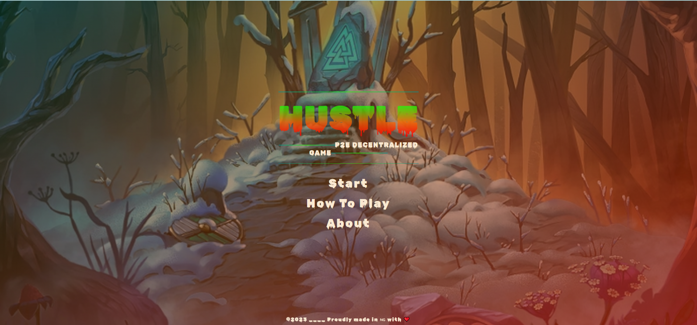

# Hustle (Runner P2E Game)

Grandida Solo-Project Submission

A play to earn Web3 runner game that rewards tokens and NFTs




Checkout the Live demo @ [Hustle](https://hustlenft.netlify.app) :sparkles:

## Overview

         Hustle is a decentralized play-to-earn game that rewards players with tokens and NFTs. Players navigate through obstacles and collect NFTs to earn rewards. The game is designed to be beginner-friendly and accessible to all users, with no technical knowledge required. Join the rapidly growing decentralized gaming community with Hustle.

#

### **`Future Development`**

Hustle is a continuously developed game with plans to add:

1. Different levels with varying difficulties
2. Different locations in the game interface
   .
3. Dynamic obstacles with the addition of a defense shield that can be purchased with NFTs won by the player.
4. While while attacking obstacles are added, A defense shield will be added to the runner which willbe bought with a particular amount of NFTs won by users.

## **`Tech Stack`**

## Technology Stack & Dependencies

- Solidity (Writing Smart Contract)
- HTML, Css, Javascript For the website
- [Infura](https://infura.io/) Account on Infura as a node provider
- [NodeJS](https://nodejs.org/en/) To install Dependencies
- [Hardhat](https://hardhat.org/) Ethereum development environment
- [Ethers.js](https://docs.ethers.io/v5/) To interact with the blockchain

### Deployment Instructions

### 1. Clone/Download the Repository

### 2. Install Dependencies:

```
$ cd contracts
```

```
$ npm install
```

### 3. Deploy NFT collection to Polygon Mumbai testnet

- Setup your env file with both private key and mumbai RPC

```
npx hardhat run scripts/deployNFTCollection.js --network mumbai
```

### 4. Deploy Run token to Polygon Mumbai testnet

- Setup your env file with both private key and mumbai RPC

```
npx hardhat run scripts/deployRunToken.js --network mumbai
```

### 5. Provide the smart contract addresses in blockchain.js file

## Credits

Developed with intentionality by [@Brime-lee](https://github.com/Brime-lee) :sparkles:

Icons used in the game are sourced from [Flaticons](https://www.flaticon.com) :sparkles:
